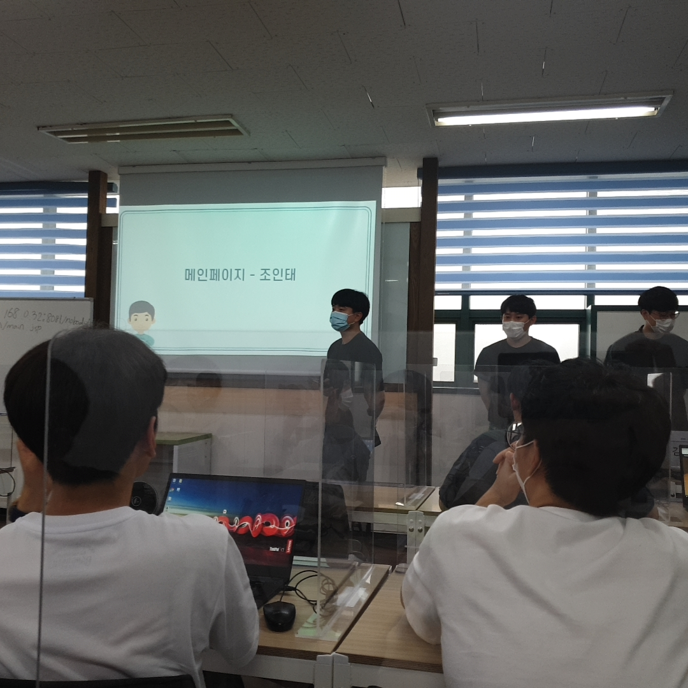
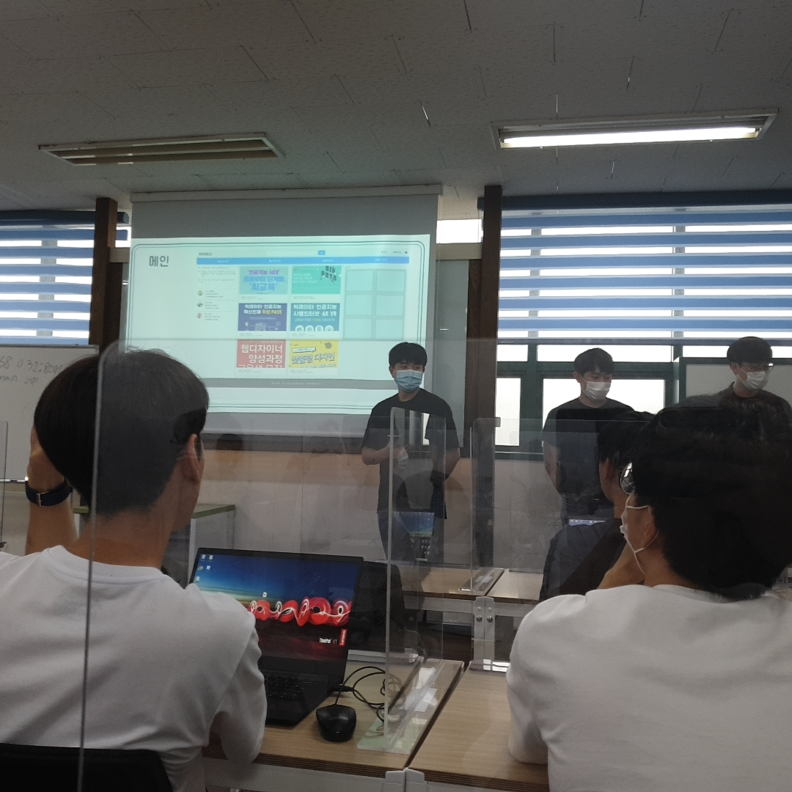

# Moble-Web-Project
### 모블 교육센터에서 진행한 팀 프로젝트 입니다.
#### 다른팀원분들의 기술적인 내용은 올리지 않고 전체적인 모습을 사진으로 넣었습니다.
#### 팀 프로젝트를 진행하며 배운 것과 더 필요한 부분에 대해 적었습니다.

1. 역활분담
    - 잘 알고 지내던 사이에서 시작된 프로젝트가 아니기에 처음에는 서먹서먹 했습니다. 가장 먼저 한일은 각자가 무엇을 할지를 정했습니다. 팀원 6명이 각각 4개의 게시판과 메인웹 그리고 로그인/회원가입을 맡았습니다. 저는 이번 프로젝트에서 HTML과 CSS를 열심히 해서 반응형 웹을 깔끔하게 구현하고자 하였습니다. DB와 서버 개발 언어로 ORACLE과 java를 사용하였고 저는 팀원들에게 DB와 java가 연동되지 않아도 되는 메인웹페이지를 하고싶다고 얘기했습니다.
2. 어려웠던 점
    - HTML과 CSS를 깊게 배워보지 않았지만 속으로는 쉬운 언어로 생각하고 있었고 누구나 '와~' 소리가 나올 이쁘고 깔끔한 웹을 만들 수 있을거라고 자만했습니다. 하지만 실상은 구현을 해보니 결과물은 발전이 없고 목표로 잡았던 모습보다 한참 못한 결과물이 나왔습니다. 이대로는 안되겠다 싶어서 일주일동안 삽질한 HTML 파일을 버리고 HTML5 + CSS3 책을 사고 인터넷으로 강의를 보며 독학을 했습니다. 프로젝트 기간은 총 8일이였으므로 5일을 삽질하고 버린 HTML에 썻지만 나머지 주말 2일과 평일 3일을 공부하여 모바일환경 + 태블릿환경 + PC환경으로 구현하였습니다. 기술적인 부분은 링크에 
    [main-web](https://github.com/JJongTaeng/firist-web-page) 정리하였습니다.
3. 발표
    - 발표 경험이 부족해서 잘할 수 있을까 싶었지만 제가 구현한 부분에 대해서 설명하는 발표였기때문에 생각한 것보다 잘한것 같았습니다. 웹이라는 같은 주제 안에서 4개의 조에서 반응형 웹을 구현한 것은 저희 조밖에 없었고 그러한 영향으로 많은 분들이 발표가 끝난 후 반응형 웹을 어떻게 구현하였는지 질문 해주셨습니다. 공부하고 배우는 것에대한 보상을 받은 기분이라 뿌듯했습니다.

4. 총 느낀점
    - 개발을 제대로 배우고 싶다고 생각하고 교육센터를 방문해서 교육 신청하고 공부를 하고있지만 배울것은 너무나 많다는 것을 느낍니다. 하지만 이전 프로젝트인 학생관리 프로그램을 java로 구현한 프로젝트보다 실력이 향상됨을 느낄 수 있었습니다. 프로젝트를 진행하면서 상호 의견을 나누며 나은 방향으로 발전시키는 것이 좋았습니다. 아직 프로젝트 경험이 많지 않아서 초기 설계단계에서 많은 시행착오를 경험하면서 구현을 진행하였습니다. 경험을 쌓아서 초기에 겪는 시행착오를 줄이고 발전된 협업을 할 것입니다. 

    
    